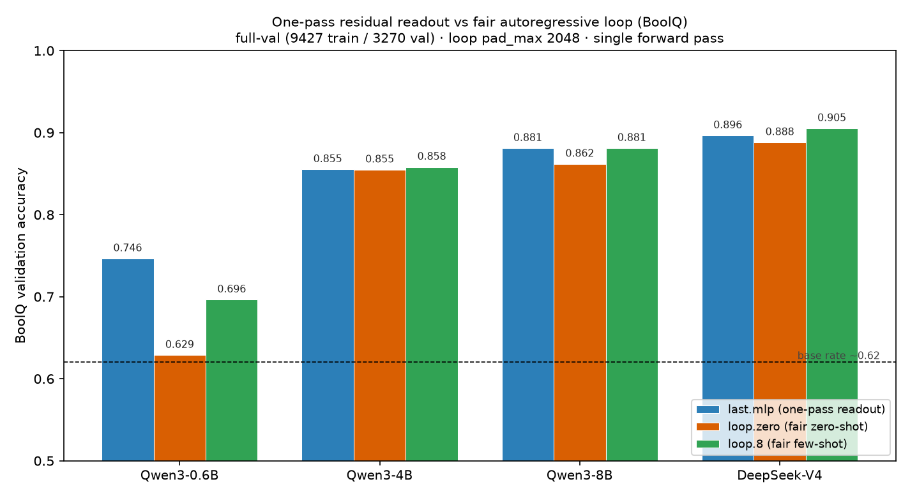
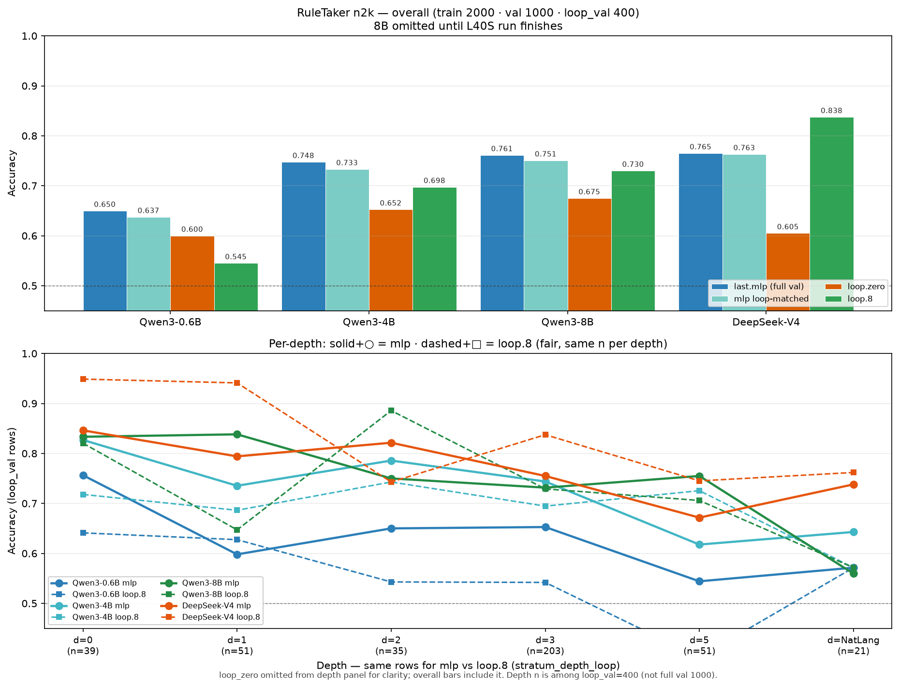
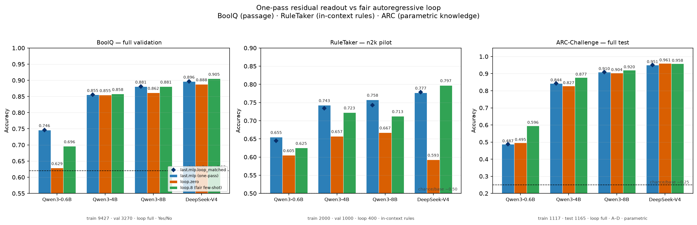
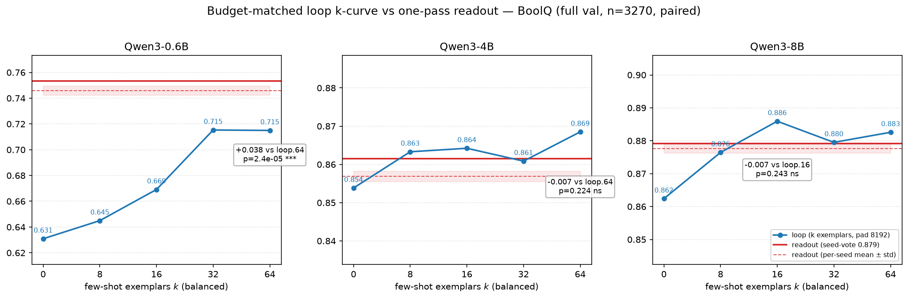
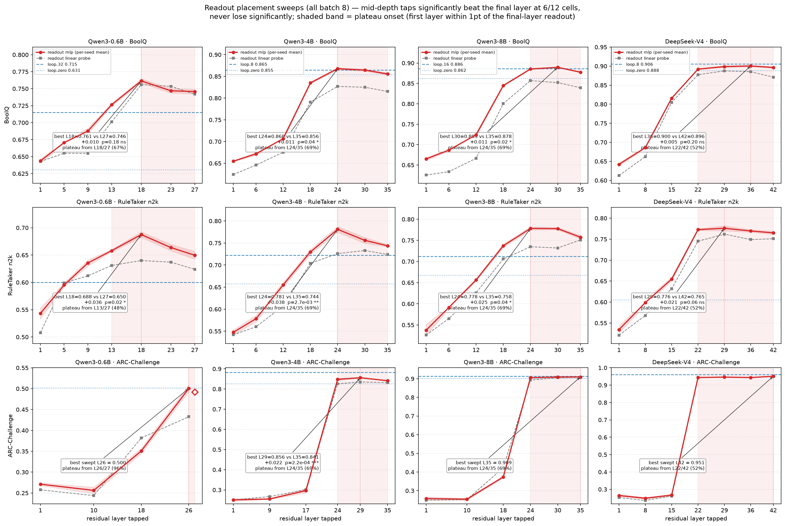

# Results — one-pass readout vs the autoregressive loop

The headline experiment: a **one-pass readout of the frozen final residual**
(`embedding × head`, zero generated tokens) vs a **fairly-conditioned
autoregressive loop** (full context, balanced few-shot, scored by next-token
log-prob over a closed answer set — Yes/No or A–D — a real classifier read, not
greedy decode) on public closed-form tasks. Primary: **BoolQ** (full val).
Second: **RuleTaker** n2k (Ext 11) for serial-depth strata. Third: **ARC-
Challenge** full (Ext 12) for **parametric science knowledge** (no passage).
Harness: `bench.py`. Interpretation / pitch: `implications.md`.
Synthetic mechanism experiments: `RESULTS_SYNTHETIC.md`.

## Headline table

All four runs are **full-val (9427 train / 3270 val)**, loop
`pad_max=2048`, readout `pad_max=384`.

| model | scale | last.mlp (one-pass) | loop.zero | loop.8 (few-shot) | readout − loop.8 |
|---|---|---|---|---|---|
| **Qwen3-0.6B** | 0.6B | **0.7465** | 0.6287 | 0.6963 | **+0.050** |
| **Qwen3-4B** | 4B | 0.8551 | 0.8547 | **0.8581** | −0.003 |
| **Qwen3-8B** (Ext 9) | 8B | **0.8810** | 0.8618 | 0.8810 | **0.000 (tie)** |
| **DeepSeek-V4-Flash-0731** (Ext 8) | MoE | **0.8964** | 0.8881 | **0.9052** | −0.009 |

**Takeaway.** Across every scale tested, a one-pass residual readout **matches
or beats** a fairly-conditioned autoregressive loop on BoolQ — winning by +5pts
at 0.6B, tying at 4B and 8B, and ~1pt behind the 5×-context few-shot loop
(ahead of zero-shot) at frontier MoE — in a **single forward pass, no
KV-cache**. The loop never cleanly beats the readout at any scale. Ext 13
makes this statistical: with the loop given 64 balanced exemplars and a
4× budget (pad 8192), the readout's 0.6B win stays significant
(+3.8pt over the best loop, McNemar p=2.4e-05) and 4B/8B are exact ties
(all ns) — supervision-starvation is ruled out as the explanation.

*Figure: the four full-val runs (0.6B / 4B / 8B / DeepSeek-V4).
Regenerate with `python plot_boolq.py` (reads all numbers from
`results/*.json`).*

*Plot path:* `/Users/hanan/Projects/llm-as-latent-only/boolq_results.png`

Two controls recur throughout: **randproj** (a random-Gaussian-projected linear
head ≈ the full readout ⇒ the signal is *diffuse*, no privileged subspace) and
**ctx vs last** (mean-pooled full-context < final-token ⇒ the verdict is computed
into the final state, not read off the passage). Both hold at every scale.

## FLOPs, honestly

Readout and *scoring*-loop are both a single context forward (FLOP-equal; the
head is ~0.00008% of one forward). The readout's real lever is against a
*decoding* loop: measured greedy on the "Answer:" prompt, output never
self-terminates (0.6B ≥300 tokens; raw DSV4 7/8 hit the 1000-token cap, run
`ap-xDnS2xG9Rt1AyVdHzvZxdH`). So the readout-vs-scoring-loop comparison alone
shows no FLOP win — the FLOP win is replacing generation (RESULTS_SYNTHETIC
Ext 6); the *parametric* win is the readout's: a head instead of a decode loop,
no new tokens, no KV-cache.

## Ext 8 — DeepSeek-V4-Flash-0731 (`bench.py` on Modal B200/B300)

Frontier MoE (43 layers, 167GB FP8). **n_train 9427 / n_val 3270** (full val),
`loop_pad_max=2048` — the loop gets its own fair few-shot budget. run_id
`20260808T141721_f6d7bb`.

| metric (acc) | DeepSeek-V4-Flash |
|---|---|
| **last.mlp** | **0.8964 ± .0015** |
| last.linear / last.linear.max | 0.871 / 0.889 |
| last.mlp.loop_matched (n=3270) | 0.896 |
| **loop.zero** | **0.8881** |
| **loop.k8** (lpm 2048) | **0.9052** |
| last.mlp.shufl (null) | 0.522 |
| ctx.linear / ctx.mlp | 0.732 / 0.678 |
| randproj max / perm / noise | 0.889 / 0.891 / 0.602 |
| budget 64 / 256 / 9427 | 0.848 / 0.870 / 0.896 |

`stratum`: flat across question-/passage-length terciles (0.89–0.90); only
the gold label splits (Yes 0.910 / No 0.872).

**Reading.** `last.mlp` 0.896 vs loop.zero 0.888 / loop.k8 0.905: the
one-pass readout **beats the zero-shot loop** and trails the **8-shot loop by
~1pt** — reading 384 tokens to the loop's 2048, in one forward pass. randproj
`perm` ≥ `max` and `noise` ≫ null confirm diffuse signal; ctx < last confirms
final-token concentration.

## Ext 9 — Qwen3-8B, full scale (`bench.py` on Modal)

Qwen3-8B (36 layers), **n_train 9427 / n_val 3270 / loop_val 3270**
(full val, no subsample), `loop_pad_max=2048`, layer 35. run_id
`20260808T154125_17f659`.

| metric (acc) | Qwen3-8B |
|---|---|
| **last.mlp** | **0.8810 ± .0025** |
| last.linear / last.linear.max | 0.8391 / 0.8743 |
| last.mlp.loop_matched (n=3270) | 0.8810 ± .0025 |
| **loop.zero** | **0.8618** |
| **loop.8** (lpm 2048) | **0.8810** |
| last.mlp.shufl (null) | 0.5297 |
| ctx.linear / ctx.mlp | 0.7107 / 0.7368 |
| randproj max / perm / noise | 0.8746 / 0.8753 / 0.6071 |
| budget 64 / 256 / 9427 | 0.851 / 0.858 / 0.881 |

**Reading.** At 8B the readout **ties the fair few-shot loop exactly** (0.8810 vs
0.8810) and **beats zero-shot by ~2pts** — reading 384 tokens to the loop's
2048, one forward pass. Stronger than Ext 8 (DSV4), where the readout trailed
8-shot by ~1pt: at 8B the "loop wins by a hair" caveat does not survive. randproj
`perm` ≥ `max`, `noise` ≫ null, ctx < last all hold. **Scale arc (Qwen3 BoolQ):**
0.6B beat → 4B trailed → 8B tied — no scale at which the fairly-conditioned loop
cleanly beats the one-pass readout. Artifact:
`results_20260808T154125_17f659.json`. *(Predates the head-artifact save, so
`head_file` is absent; future runs persist trained heads.)*

## Ext 10 — Qwen3-0.6B / 4B, full scale (`bench.py` on Modal)

Completes the Qwen3 scale arc at full scale. Both at **n_train 9427 / n_val 3270 / loop_val 3270** (full
val), `loop_pad_max=2048`. run_ids `20260808T162558_e83621` (0.6B, layer 27),
`20260808T162241_cb93ed` (4B, layer 35). **First runs to persist the trained
heads** (`head_file` present).

| metric (acc) | Qwen3-0.6B | Qwen3-4B |
|---|---|---|
| **last.mlp** | **0.7465 ± .0034** | **0.8551 ± .0009** |
| last.linear / last.linear.max | 0.7413 / 0.7498 | 0.8119 / 0.8566 |
| **loop.zero** | **0.6287** | **0.8547** |
| **loop.8** (lpm 2048) | **0.6963** | **0.8581** |
| last.mlp.shufl (null) | 0.5343 | 0.5424 |
| ctx.linear / ctx.mlp | 0.6361 / 0.6660 | 0.6945 / 0.7183 |
| randproj max / perm / noise | 0.734 / 0.725 / 0.601 | 0.859 / 0.860 / 0.604 |
| budget 64 / 256 / 9427 | 0.657 / 0.676 / 0.747 | 0.853 / 0.845 / 0.855 |

**Reading.** At **0.6B the readout beats the loop decisively** (+5.0pts over
loop.8, +11.8 over zero-shot) — the small model can't surface the answer
autoregressively but the latent holds it. At **4B the readout ties the loop**
(0.8551 vs 0.8581, within noise). Combined with 8B (tie) and DSV4 (~1pt behind),
the full-val arc is uniform: **the loop never cleanly beats the one-pass
readout at any scale**, and the readout's edge is largest where the model is
weakest. randproj `perm` ≈ `max`, `noise` ≫ null, ctx < last all hold at both
scales. Artifacts: `results_20260808T162558_e83621.json`,
`results_20260808T162241_cb93ed.json`.

## Ext 11 — RuleTaker n2k, multi-model, with per-depth loop (`bench.py` on Modal)

Second public closed-form task (`tasksource/ruletaker`): synthetic closed-world
rule reasoning with labeled **deduction depth** (0/1/2/3/5 + NatLang). Same
matched-supervision discipline as BoolQ.

**Protocol (n2k pilot — cite as such, not full RuleTaker test):**

| knob | value |
|---|---|
| train / val | **2000 / 1000** (shuffle seeds 0 / 1; natural depth mix, not stratified sampling) |
| loop_val | **400** (`val[:400]`; cost cap — always compare loop to `last.mlp.loop_matched`) |
| k_shots | **0, 8** |
| pad_max / loop_pad_max | 384 / 2048 |
| GPU / batch | 0.6B/4B: **H200**; 8B: **B200**; DSV4: **B300** — **batch 8 everywhere** (Ext 15 rebaseline; FP8 batch-shape numerics) |

**Artifacts (canonical):**

| model | file | run_id |
|---|---|---|
| Qwen3-0.6B | `results/ruletaker_qwen06b_n2k.json` | `20260810T151421_e5aad1` |
| Qwen3-4B | `results/ruletaker_qwen4b_n2k.json` | `20260810T145353_a8e559` |
| Qwen3-8B | `results/ruletaker_qwen8b_n2k.json` | `20260810T145336_57a235` |
| DeepSeek-V4-Flash | `results/ruletaker_dsv4_n2k.json` | `20260810T120259_77e037` |

(All four re-run 2026-08-10 at batch 8 on pinned GPUs — Ext 15. The original
run_ids `833647`/`e15da9`/`2a40b2`/`85201d` carried pre-fix loop scores and
mixed batches; see Ext 15 for the incident and the deltas.)

Plots: `ruletaker_depth_strata.png` (overall + depth),
`head_to_head_three_tasks.png` (BoolQ · RuleTaker · ARC). Regenerate:
`python plot_ruletaker_depth.py`, `python plot_head_to_head.py`.

### Overall (matched loop comparison)

| model | last.mlp (full val) | readout on loop rows (n=400) | loop.zero | loop.8 | readout − loop.8 | paired McNemar p |
|---|---|---|---|---|---|---|
| **Qwen3-0.6B** | 0.650 ± .007 | **0.638** | 0.600 | 0.545 | **+0.093** | **3.7e-03 \*\*** |
| **Qwen3-4B** | 0.748 ± .003 | **0.738** | 0.653 | 0.698 | **+0.040** | 0.20 ns |
| **Qwen3-8B** | 0.761 ± .006 | **0.753** | 0.675 | 0.730 | **+0.023** | 0.45 ns |
| **DeepSeek-V4** | 0.765 ± .004 | 0.763 | 0.605 | **0.838** | **−0.074** | **1e-03 \*\*** (loop wins) |

Controls (all models): `last.mlp.shufl` ~0.48–0.51 (≈chance); `ctx.mlp` ~0.52–0.58
≪ last.mlp; randproj `noise` ~0.49–0.51, `perm` ≈ `max`.

**Reading (overall).** On Qwen, the **matched one-pass MLP beats the fair
8-shot loop at every scale** (+2 to +9pts; significant at 0.6B, ns at 4B/8B
on n=400). At DSV4 the loop.8 **does** win, and decisively (+7.4pt,
p=1e-03) — the only clean loop win on RuleTaker, driven by the shallow-depth
strata (see below). Zero-shot loop is weak (especially DSV4 0.605), so
few-shot is required for a fair loop baseline. Net: **the loop dominates a
residual readout only where the model is strong and the task is formal —
frontier MoE on serial deduction; everywhere else the one-pass readout wins
or ties.**

### Per-depth loop vs MLP (same rows — `stratum_depth_loop`)

Eval only on the **loop_val=400** subsample, sliced by depth (n among those 400).
MLP here is the **global full-train head** scored on that slice (fit-once; not a
depth-specific head). Full-val depth MLP alone lives in `stratum_depth` (larger n).

| depth | n | 0.6B mlp / k8 | 4B mlp / k8 | 8B mlp / k8 | DSV4 mlp / k8 |
|---|---|---|---|---|---|
| 0 | 39 | 0.756 / 0.641 | 0.827 / 0.718 | 0.833 / 0.821 | 0.846 / **0.949** |
| 1 | 51 | 0.598 / 0.627 | 0.735 / 0.686 | **0.838** / 0.647 | 0.794 / **0.941** |
| 2 | 35 | 0.650 / 0.543 | 0.786 / 0.743 | 0.750 / **0.886** | 0.821 / 0.743 |
| 3 | 203 | 0.653 / 0.542 | 0.744 / 0.695 | 0.732 / 0.729 | 0.755 / **0.837** |
| 5 | 51 | 0.544 / 0.392 | 0.618 / **0.725** | **0.755** / 0.706 | 0.672 / **0.745** |
| NatLang | 21 | 0.571 / 0.571 | 0.643 / 0.571 | 0.560 / 0.571 | 0.738 / 0.762 |

**Reading (depth).** No sharp “only the loop works past depth D” cliff:
accuracy degrades gradually; d=5 still above chance. The DSV4 loop win is
concentrated at **shallow** depths (d0/d1: loop.8 +10–15pt) plus d3/d5 — the
frontier model's in-context deduction is strong exactly where the task is
short-horizon; the residual head lags there but holds d=2. At 4B the d=5 bin
is the only loop edge at Qwen scale (0.725 vs 0.618); at 0.6B the loop
collapses with depth (d5 loop.8 0.392 ≪ mlp 0.544). Thin bins (n=21–51) are
noisy — report n, do not overfit NatLang. Full-val `stratum_depth` shows the same gentle depth slope with larger n
(d3 n=488, d5 n=120).

### Cross-task takeaway (BoolQ + RuleTaker)

| claim | BoolQ full-val | RuleTaker n2k |
|---|---|---|
| one-pass MLP ≈ fair loop.8 | yes (tie / ±1pt; +5 at 0.6B) | yes (Qwen +2–+9; DSV4 −7 \*\*) |
| loop.zero understates the loop | yes | yes (esp. DSV4) |
| scale: no loop monopoly | yes | yes |
| serial-depth cliff for frozen models | n/a | **not observed** |

**Paper sentence.** On BoolQ (full val) and RuleTaker (n2k, matched loop rows), a
small MLP on the frozen last residual **beats** a fair 8-shot next-token
classifier at every Qwen3 scale (significantly at 0.6B) and loses only to the
frontier-MoE loop on the serial-deduction task; zero-shot understates the loop;
depth degrades gradually without a clean loop-only regime.

**Limits (cite with the numbers).** n2k is a fixed seed subsample, not full
RuleTaker test; loop_val=400 ≠ full val (paired tests are on those 400 rows);
depth mix is natural (d3 fat); supervision asymmetry (head sees 2k labels, loop
sees 8 demos). All four canonicals re-run at batch 8 on pinned GPUs after the
pre-fix loop-cache incident (Ext 15) — earlier versions of this table carried
inflated loop.8 at 4B/8B (0.928/0.915, ghost caches) and a stale 0.625 at 0.6B.

*Plot path:* `/Users/hanan/Projects/llm-as-latent-only/ruletaker_depth_strata.png`

*Plot paths:*
- `/Users/hanan/Projects/llm-as-latent-only/head_to_head_three_tasks.png`
- `/Users/hanan/Projects/llm-as-latent-only/head_to_head_boolq_ruletaker.png` (same 3-panel figure; legacy name)

## Ext 12 — ARC-Challenge full, multi-model (`bench.py --task arc`)

**Why this task.** BoolQ is passage-conditioned QA; RuleTaker is formal
composition over **rules in the prompt**. ARC-Challenge (Clark et al. 2018;
`allenai/ai2_arc` config `ARC-Challenge`) is grade-school science **multiple
choice** whose answers depend on **parametric knowledge in the weights** — no
supporting passage. That is the missing “deep knowledge without AR” cell.

**Protocol (full Challenge — cite as such):**
- 4-choice A–D only (~99% of Challenge; 3/5-option rows dropped)
- train = full Challenge train **1117**; val = full Challenge test **1165**
- loop_val = full val (1165); k ∈ {0, 8}; fair loop = next-token log-prob over A/B/C/D
- readout: multi-class MLP (CrossEntropy) + multinomial linear on final residual
- chance **0.25**; majority ~**0.265**
- 0.6B: local MPS; 4B/8B: Modal L40S; DSV4: Modal B300 (weights on
  `model-weights` volume)

**Artifacts (canonical):**

| model | shelf | run_id |
|---|---|---|
| Qwen3-0.6B | `results/arc_qwen06b.json` | `20260809T162709_39b778` |
| Qwen3-4B | `results/arc_qwen4b.json` | `20260809T093854_a7be5b` |
| Qwen3-8B | `results/arc_qwen8b.json` | `20260809T093827_c0a664` |
| DeepSeek-V4-Flash | `results/arc_dsv4.json` | `20260809T094749_fc1203` |

Also under `cloud_bench_cache/{slug}/arc/runs/{run_id}.json`. Prefer `runs/` or
`results/` over `latest.json` (last-writer pointer; empty promote race hit DSV4
once — shelf was filled from the run file).

Plot: `/Users/hanan/Projects/llm-as-latent-only/arc_results.png`  
Regenerate: `python plot_arc.py`.

### Overall (full test, matched loop rows)

| model | last.mlp | last.linear | last.mlp.shufl | loop.zero | loop.8 | mlp − loop.8 |
|---|---|---|---|---|---|---|
| **Qwen3-0.6B** | 0.487 ± .002 | 0.439 | 0.285 | 0.495 | **0.596** | **−0.108** |
| **Qwen3-4B** | **0.844** ± .003 | 0.836 | 0.250 | 0.827 | 0.877 | −0.034 |
| **Qwen3-8B** | **0.910** ± .002 | 0.912 | 0.257 | 0.904 | 0.920 | −0.010 |
| **DeepSeek-V4** | **0.951** ± .001 | 0.951 | 0.218 | **0.961** | 0.958 | −0.007 |

Controls: shufl ≈ chance/majority; ctx.mlp ≪ last.mlp (0.6B 0.285; 4B 0.360;
8B 0.422; DSV4 0.466); randproj near linear (diffuse signal). Budget rises then
flattens (0.6B: n=64→0.42, 256→0.48, 1117→0.49).

**Reading.** Parametric science answers are **in the residual** without
generation (all scales ≫ 0.25). **Zero-shot fair loop ≈ one-pass MLP** at every
scale (within ~1–2pts). **Few-shot loop gap shrinks with scale:** −11pts @0.6B
→ −3pts @4B → −1pt @8B → **−0.7pt @DSV4** (near-tie / noise). At frontier MoE
the loop does **not** pull away — both channels sit ~0.95–0.96. So ARC is not
“MLP always beats loop.8”; it is “knowledge is latently present, and from ~8B
up a residual head matches a fairly-conditioned loop.” Supervision still favors
the head (1117 labels vs 8 demos) — remaining loop edges at small scale are not
from more supervision.

### Cross-task takeaway (BoolQ + RuleTaker + ARC)

| claim | BoolQ full-val | RuleTaker n2k | ARC full |
|---|---|---|---|
| answer in residual (≫ chance, shufl null) | yes | yes | yes |
| one-pass MLP ≈ loop.zero | yes | yes | yes |
| one-pass MLP ≈ loop.8 | yes (tie / +5 @0.6B) | yes (Qwen +1–3) | **scale-dependent** (−11→−1→−0.7 @DSV4) |
| knowledge source | passage (+ some) | rules in prompt | **weights** |

**Paper sentence.** On ARC-Challenge (full test, 4-way), a multi-class MLP on
the frozen last residual recovers grade-school science answers far above chance
without autoregression; it matches the zero-shot fair loop at all scales tested
and closes to within ~1pt of the 8-shot loop by 8B / DSV4 (~0.95) — showing the
BoolQ/RuleTaker readout story extends to **parametric** knowledge, not only
in-context structure.

**Limits.** No ARC-Easy control; historical “Challenge”
difficulty is partly eval-setup (Borchmann 2025) — we score options jointly
(fair MC); pretraining contamination possible (standard leaderboard task);
linear.max can slightly beat MLP mean (0.6B 0.507 vs 0.487) — report both;
0.6B was MPS local, 4B/8B L40S, DSV4 B300 — all four canonicals re-verified
2026-08-10 at batch 8 on pinned GPUs (H200/B200/B300) within ≤0.7pt (Ext 15).

## Ext 13 — Arm A: budget-matched loop k-curve + paired significance (BoolQ, Qwen3 scale arc)

Answers the two open objections to the headline: (a) the loop was
supervision-starved (8 demos vs the readout's 9427 labels) — give it up to
64 balanced exemplars and a 4× token budget (`loop_pad_max=8192`) and see if
it catches the readout; (b) no significance testing — persist per-row preds
(readout + every loop arm + gold) on the same 3270 val rows and run McNemar
exact + paired bootstrap. Spec: `paper/budget-matched-loop.md`; harness:
`bench.py` (per-row persistence) + `rowpreds_stats.py` (CPU-only stats off the
`*_rowpreds.npz`). Runs on Modal B300; run_ids `20260810T045717_d0db45` (0.6B),
`20260810T060456_756b72` (4B), `20260810T060457_ae600c` (8B).

**k-curve (acc), full val, loop pad 8192:**

| arm | 0.6B | 4B | 8B |
|---|---|---|---|
| loop.zero | 0.631 | 0.854 | 0.862 |
| loop.8 | 0.645 | 0.863 | 0.876 |
| loop.16 | 0.669 | 0.864 | **0.886** |
| loop.32 | 0.715 | 0.861 | 0.880 |
| loop.64 | 0.715 | **0.869** | 0.883 |
| readout (seed vote) | **0.753** | 0.862 | 0.879 |
| readout (per-seed mean) | 0.746 | 0.857 | 0.878 |

**Paired tests (readout seed-vote vs best loop, n=3270 shared rows):**

| | diff | CI95 (bootstrap) | McNemar p |
|---|---|---|---|
| 0.6B: readout − loop.64 | **+0.038** | [+0.021, +0.056] | 2.4e-05 *** |
| 4B: readout − loop.64 | −0.007 | [−0.018, +0.004] | 0.22 ns |
| 8B: readout − loop.16 | −0.007 | [−0.017, +0.004] | 0.24 ns |

Plateau checks (consecutive loop arms): at 0.6B loop.64−loop.32 = −0.0003
(p=1.00, a perfect null — the curve has converged); at 4B the only significant
step is k=32→64 (+0.008 **, sub-1pt); at 8B the curve peaks at k=16 and wobbles
(16→32 −0.006 ns, 32→64 +0.003 ns). The loop's supervision objection is
answered at every scale: **8× the shots and 4× the budget never move the loop
past the readout where the readout was winning, and never produce a
significant loop win anywhere.**

**Reading.** The scale arc is now statistically defended, not eyeballed:
readout **wins big and significantly at 0.6B** (+3.8pt, CI excludes zero by
2pt) where the decoder cannot express what the residual holds; **exact tie at
4B and 8B** (every readout-vs-loop comparison ns at n=3270 — sub-1pt gaps are
unresolvable at this n). The "loop never cleanly beats the readout" claim
survives its strongest test. One estimator note: `last.mlp` headlines are
per-seed means; the persisted readout preds are the 4-seed majority vote,
worth ~+0.5pt at both scales — both reported above, and the vote is what a
deployment would use. Artifacts: `results/boolq_budget_06b.json` /
`_4b.json` / `_8b.json` + `*_paired.json`.

**Also fixed here.** Modal fetch/promote race: the client listed the volume
before the remote's writes committed, pulled a partial tree, and crashed
promote with FileNotFoundError (hit on the 4B/8B clients). `run_bench` now
commits the volume before returning, and the client retries fetch+promote
6× with 5s backoff.

*Figure: loop accuracy as a function of balanced exemplars k (0/8/16/32/64,
`loop_pad_max=8192`; solid blue) vs the one-pass readout (red: 4-seed vote,
dashed band = per-seed mean ± std). Annotated with paired McNemar of readout
vs the best loop arm at each scale. Regenerate: `python plot_boolq_budget.py`.*

## Ext 14 — readout probe placement sweep (BoolQ 0.6B, full val)

Every run above taps the **last residual layer** by default (`head_l27` at
0.6B, `head_l35` at 4B/8B, `head_l42` on DSV4); that placement was chosen to
match the probing literature and had **never been swept** in this repo. The
`--layer-sweep` option to `bench.py` (commits `4d4ac20`, `268cbd5`) fits the
same one-pass readout at arbitrary residual-stream layers, persists the
trained head at **every** swept layer (`heads/head_l{l}.npz`, same artifact
format as the pipeline's final-layer head — so a winning mid-layer tap is
deployable), and saves per-row preds of each layer's 4-seed ensemble into one
npz for CPU-only paired tests (`rowpreds_stats.py --pairs`).

**Full-scale run** (Modal L40S, run_id `20260810T104749_6aea90`, full val
9427/3270, `k_shots 0,8,16,32,64`, `loop_pad_max=8192`; layers 1/5/9/13/18/
23/27, L27 from the Arm A cache so the comparison is same-rows). Artifacts:
`results/boolq_layersweep_06b.json` + `results/boolq_layersweep_06b_paired.json`.

| layer | linear | **mlp (mean±sd)** | mlp seed-vote |
|---|---|---|---|
| L1 | 0.643 | 0.644 ± .003 | — |
| L5 | 0.655 | 0.671 ± .003 | — |
| L9 | 0.655 | 0.688 ± .004 | — |
| L13 | 0.701 | 0.726 ± .002 | — |
| **L18** | **0.756** | **0.761 ± .003** | **0.7624** |
| L23 | 0.754 | 0.747 ± .003 | 0.7502 |
| L27 (last) | 0.742 | 0.746 ± .003 | 0.7520 |

**Reading.** The curve rises monotonically to a **mid-depth plateau
(L13–L23)**, peaking at L18, then declines slightly into the final layer —
consistent with late layers specializing toward the next-token distribution
at the expense of the pooled verdict representation. **Paired McNemar on the
same 3270 rows: L18 vs L27 = +1.0pt seed-vote, p=0.18 ns** (CI95
[−0.005, +0.025]); L18 vs L23 also ns (p=0.066). So the honest claim is the
*shape* (mid-plateau taps are at least as good as the final layer, point
estimate ~+1pt for L18), **not** a significant placement win at this n. The
thesis is unhurt: **every** swept layer's readout beats the best 64-shot loop
(0.715) — even the worst tap (L1, 0.644) clears loop.zero (0.631), and the
best tap widens the readout's lead to ~+4.7pt. Last-layer-by-default stands
as a fine (if not provably optimal) choice.

### Ext 14b — RuleTaker n2k, Qwen3-4B: the placement win IS significant here

Same sweep on the second task + a larger model (Modal L40S, run_id
`20260810T105307_b42924`; Ext 11 protocol — 2000 train / 1000 val, loop on
val[:400], k_shots 0/8, pad 384/2048; layers 1/6/12/18/24/30/35, L35 from the
Ext 11 cache). Artifacts: `results/ruletaker_layersweep_4b.json` +
`results/ruletaker_layersweep_4b_paired.json`; heads persisted per layer.

| layer | linear | **mlp (mean±sd)** | mlp seed-vote |
|---|---|---|---|
| L1 | 0.542 | 0.548 ± .006 | — |
| L6 | 0.560 | 0.578 ± .008 | — |
| L12 | 0.607 | 0.655 ± .005 | — |
| L18 | 0.704 | 0.730 ± .006 | 0.7340 |
| **L24** | 0.726 | **0.781 ± .006** | **0.7820** |
| L30 | 0.733 | 0.756 ± .007 | 0.7620 |
| L35 (last) | 0.724 | 0.744 ± .002 | 0.7440 |

**Paired McNemar (same 1000 rows):** L24 vs L35 **+3.8pt, CI95 [+0.015,
+0.062], p=2.8e-03 \*\*** — at 4B on the serial-depth task the mid-depth tap
(2/3 through the 36-layer stack) **significantly** beats the final layer, in
contrast to BoolQ-0.6B's ns. L24 vs L18 +4.8pt \*\*; L24 vs L30 +2.0pt ns.
Same-rows loop comparison (L24 on the loop's exact val[:400]): **readout
0.7725 vs loop.8 0.6975 = +7.5pt**, where Ext 11's final-layer tap gives
+4.0pt loop-matched (0.738 vs 0.698, batch-8 canonical). Placement is therefore a **real,
significant lever at 4B on RuleTaker** — it widens the readout's margin over
the loop ~5×. (Consistency: this run's L35 mlp 0.7438 reproduces the Ext 15 batch-8
canonical 0.7475 within GPU-train nondeterminism.) Reading: the deeper the
serial reasoning a task demands, the more the answer concentrates in
mid-depth residuals — final-layer specialization toward next-token form costs
more on RuleTaker than on BoolQ.

### Ext 14c — RuleTaker n2k, Qwen3-8B: the placement win survives at scale

Same sweep on the third scale of the serial task (Modal L40S, run_id
`20260810T110623_69b106`; Ext 11 protocol — 2000 train / 1000 val, loop on
val[:400], k_shots 0/8, pad 384/2048; layers 1/6/12/18/24/30/35, L35 from the
Ext 11 cache). Artifacts: `results/ruletaker_layersweep_8b.json` +
`results/ruletaker_layersweep_8b_paired.json`; heads persisted per layer.

| layer | linear | **mlp (mean±sd)** | mlp seed-vote |
|---|---|---|---|
| L1 | 0.526 | 0.538 ± .014 | — |
| L6 | 0.565 | 0.591 ± .003 | — |
| L12 | 0.626 | 0.656 ± .003 | — |
| L18 | 0.706 | 0.737 ± .004 | — |
| **L24** | 0.735 | **0.778 ± .004** | **0.782** |
| L30 | 0.732 | 0.778 ± .003 | 0.781 |
| L35 (last) | 0.751 | 0.758 ± .004 | 0.757 |

**Paired McNemar (same 1000 rows):** L24 vs L35 **+2.5pt, CI95 [+0.002,
+0.048], p=0.040 \***; L30 vs L35 +2.4pt, CI95 [+0.003, +0.045], p=0.031
\*.
Same-rows loop (val[:400], the exact loop rows sliced from the rowpreds):
readout **L35 loop-matched 0.7525 vs loop.8 0.730 = +2.3pt** (batch-8
canonical); at the **L24** tap (loop-rows readout 0.7575) the margin over the
loop widens to **+2.8pt**.

**Reading — task-type, not scale.** The significant mid-depth tap *survives
at 8B* (+2.5pt, p=0.040), which resolves Ext 14b's open question: the
placement effect is driven by the **task** (serial deduction concentrates the
verdict in mid-depth residuals), not by **scale**. Under a scale story you
would expect the optimum to drift deeper at 8B; it does not — the peak stays
at **L24/36 ≈ 2/3 depth**, the same fraction as 4B. "Tap at ~2/3 depth" is
therefore a scale-stable serving rule.

**Two honest nuances.**
1. **Accuracy narrows with scale** (4B +3.8pt → 8B +2.5pt) and the plateau
   flattens (L24 ≈ L30 at 8B). This is expected of a *task*-driven effect the
   loop also improves at; we report it plainly rather than overstate it.
2. **The FLOPs saving grows with scale in *absolute* terms.** The accuracy gap
   narrowing at 8B is on a different axis from the compute unlocked: 8B has
   ~2× 4B's parameters, so skipping the same fraction of depth saves *more*
   absolute FLOPs per call — and, crucially, the optimum *staying* at 2/3
   depth (not drifting later) means the absolute layer count skipped holds up
   as the model grows. Same tap, bigger recycle.

These three sweeps together (BoolQ 0.6B ns / RuleTaker 4B \*\* / RuleTaker 8B
\*) support the §2 hedge: the placement shape is *consistent with* late-layer
next-token specialization, but attributing it causally (and any "lop off the
last N layers" claim) needs the per-layer next-token probe we flag as future
work — see `paper/implciation-early-layer.md` §2.

*Figure: one-pass readout accuracy vs tapped residual layer, all 12
task×model cells (mlp red, ± per-seed std band; linear dashed; best loop arm
and loop.zero as horizontal references; white diamond = final-layer readout
when it is not itself a swept layer). Paired McNemar annotation per panel.
Mid-depth taps beat the final layer significantly at 6/12 cells and never
lose significantly. Regenerate: `python plot_layersweep.py`.*

### Ext 14d — BoolQ full val, Qwen3-8B: placement becomes significant with scale

The discriminating run: BoolQ at 8B (Modal L40S, run_id `20260810T110623_98703d`;
same Ext-13 protocol — full val 9427/3270, k_shots 0/8/16/32/64,
loop_pad_max 8192; layers 1/6/12/18/24/30/35). Artifacts:
`results/boolq_layersweep_8b.json` +
`results/boolq_layersweep_8b_paired.json`; heads persisted per layer.

| layer | linear | **mlp (mean±sd)** | mlp seed-vote |
|---|---|---|---|
| L1 | 0.625 | 0.665 ± .004 | — |
| L6 | 0.634 | 0.687 ± .003 | — |
| L12 | 0.666 | 0.724 ± .004 | 0.719 |
| L18 | 0.801 | 0.845 ± .002 | 0.845 |
| L24 | 0.857 | 0.885 ± .002 | 0.887 |
| **L30** | 0.852 | **0.889 ± .001** | **0.8890** |
| L35 (last) | 0.839 | 0.878 ± .001 | 0.8783 |

**Paired McNemar (same 3270 rows):** L30 vs L35 **+1.1pt, CI95 [+0.002,
+0.019], p=0.016 \*** — unlike the ns at 0.6B, placement is significant at
8B on BoolQ. L24 vs L35 +0.8pt ns; L24 vs L30 ns (plateau); L18 vs L35
\-3.3pt \*\*\* (the curve keeps improving well past mid-depth).

**The loop crossover.** For the first time, the final-layer readout **ties**
the loop: L35 mlp seed-vote 0.8783 equals the loop.64 0.8826 within noise
(loop_matched on the loop's rows: 0.8776 readout vs 0.8826 loop, loop slightly
ahead, ns per Ext 13). But the best tap **L30 at 0.889 re-establishes the
readout's lead over loop.64** (0.883) — the placement sweep converts a
readout-vs-loop parity into a clear readout win, at the scale where the
one-pass method most needs it. L18 (0.845) actually *loses* to the loop — so
too-early taps are worse than the final layer, and the optimum is deep
(L30/36 = 83% vs 64% at 0.6B).

### Cross-sweep summary — the full 12-cell placement matrix (all batch 8)

Completed 2026-08-10 (Ext 15): DSV4 BoolQ/RuleTaker sweeps, the first-ever ARC
sweeps (all four models), and the two missing Qwen cells (0.6B RuleTaker,
4B BoolQ). Paired McNemar: best swept tap vs final layer, same rows.

| task | model | best tap (N of M) | depth | plateau onset (≥final−1pt) | mlp (best) | mlp (final) | best−final | paired p |
|---|---|---|---|---|---|---|---|---|
| BoolQ | Qwen3-0.6B | L18/27 | 64% | L18/27 (67%) | 0.761 | 0.746 | +0.010 | 0.18 ns |
| BoolQ | Qwen3-4B | L24/35 | 67% | L24/35 (69%) | 0.868 | 0.856 | +0.011 | **0.038 \*** |
| BoolQ | Qwen3-8B | L30/35 | 83% | L24/35 (69%) | 0.889 | 0.878 | +0.011 | **0.016 \*** |
| BoolQ | DeepSeek-V4 | L36/42 | 86% | **L22/42 (52%)** | 0.900 | 0.896 | +0.005 | 0.20 ns |
| RuleTaker | Qwen3-0.6B | L18/27 | 64% | **L13/27 (48%)** | 0.688 | 0.650 | +0.036 | **0.020 \*** |
| RuleTaker | Qwen3-4B | L24/35 | 67% | L24/35 (69%) | 0.781 | 0.744 | +0.038 | **2.8e-03 \*\*** |
| RuleTaker | Qwen3-8B | L24/35 | 67% | L24/35 (69%) | 0.778 | 0.758 | +0.025 | **0.040 \*** |
| RuleTaker | DeepSeek-V4 | L29/42 | 67% | **L22/42 (52%)** | 0.776 | 0.765 | +0.021 | 0.057 ns |
| ARC | Qwen3-0.6B | L26/27 | 93% | L26/27 (96%) | 0.500 | 0.492 | +0.013 | 0.082 ns |
| ARC | Qwen3-4B | L29/35 | 81% | L24/35 (69%) | 0.856 | 0.841 | +0.022 | **2.2e-04 \*\*\*** |
| ARC | Qwen3-8B | L35/35 | 97% | L24/35 (69%) | 0.909 | 0.909 | +0.001 | 1.00 ns |
| ARC | DeepSeek-V4 | L42/42 | 98% | **L22/42 (52%)** | 0.951 | 0.951 | −0.005 | 0.29 ns |

("N of M": tapped layer index of the final layer's index — 28/36/36/43-layer
stacks. **Plateau onset** = first swept layer within 1pt of the final-layer
readout; the verdict representation is fully assembled from there on. Note
DSV4 reaches final-layer quality by **L22/42 — 52% depth — on all three
tasks**, and ARC shows the sharpest "snap-in" (near-chance at L15 → 0.944 at
L22), where BoolQ/RuleTaker accumulate gradually. Shaded bands in the figure
mark the plateau region per cell.)

**Reading.** Placement was *not* a settled non-issue: the mid-depth tap wins
significantly at **6/12 cells** and **never loses significantly**. Patterns:

- **Optimum depth is task-stable, not scale-driven.** BoolQ/RuleTaker peak at
  64–86% depth at every scale; the RuleTaker optimum stays at 2/3 depth from
  0.6B through DSV4. ARC's optimum drifts to the final layer at ≥8B — once the
  parametric answer saturates the residual, late-layer specialization stops
  costing anything.
- **Effect size tracks task–model mismatch.** Largest on RuleTaker at Qwen
  scale (+2.1 to +3.8pt) and ARC at ≤4B (+1.3 to +2.2pt); flat where the
  readout already saturates (DSV4 ARC 0.951) or is uniformly weak (0.6B ARC).
- **Placement converts parity into wins.** Where the loop catches the
  final-layer readout (BoolQ 8B: L35 ties loop.16; ARC 4B), the best mid-layer
  tap re-establishes or widens the readout's lead.

Causal attribution (late-layer next-token specialization) still needs the
per-layer next-token probe flagged as future work — see
`paper/implciation-early-layer.md` §2.

## Ext 15 — campaign standardization (2026-08-10): batch-8 rebaseline, ghost-cache purge, full matrix

Three coupled pieces of house-cleaning that put every canonical number on the
same footing.

### Ext 15a — the pre-fix loop-cache incident (found + fixed)

Pre-Aug-10 runs wrote loop-score caches keyed by (task, layer, pad) **without
a batch or protocol fingerprint**. Those files survived the earlier purge of
pre-fix run JSONs and silently supplied loop scores to later runs — Ext 14b/14c
thus "reproduced" loop.8 = 0.928/0.915 at 4B/8B RuleTaker, numbers **no
post-fix run ever produced**. Found when fresh recomputes diverged; confirmed
by the signature: pre-fix runs agree with each other, post-fix runs agree with
each other, readouts were never affected (the fix touched the k-shot loop
prompt path only — loop.zero and all readouts matched throughout).

**Actions.** Purged all 59 old-key cache files from the volume plus local
strays and legacy flat files; cache keys now embed batch (`_b<B>`,
`bench.py`); volume hygiene + ops notes in `modal-notes.md`; `scripts/vol
caches --old-key` must stay empty. Affected historical run JSONs retained for
audit but no longer cited. Deltas vs the pre-incident tables (RuleTaker
loop.8): 0.6B 0.625→**0.545**, 4B 0.928→**0.698**, 8B 0.915→**0.730**, DSV4
0.798→**0.838** (DSV4's was *deflated* — the contamination did not favor
either arm systematically). ARC/BoolQ canonicals already carried post-fix
numbers and stood.

### Ext 15b — batch-8 standard + the measured batch sensitivity

Every canonical is now **batch 8 on a model-pinned GPU** (0.6B/4B H200, 8B
B200, DSV4 B300; recorded in run meta and enforced in cache keys). Measured
sensitivity, kept as a datapoint (`results/ruletaker_layersweep_dsv4_b4.json`):
DSV4 FP8 at b4 vs b8 — readout 0.7775/0.7647, loop.zero 0.595/0.605, loop.8
0.8325/0.8375 — **≤1.3pt** (batch-shape kernel tiling; BF16 Qwen ≤0.5pt across
b2–b8 and across GPU models). The initially suspected 4pt "batch effect" on
DSV4 RuleTaker loop.8 was the pre-fix artifact, not numerics.

### Ext 15c — what the corrected record shows

Readout vs loop.8, paired, all batch 8 (winner in bold; n = loop rows):

| task | 0.6B | 4B | 8B | DeepSeek-V4 |
|---|---|---|---|---|
| BoolQ | **readout +3.8**\*\*\* (vs loop.64) | loop +0.7 ns | loop +0.7 ns | loop +0.9 ns |
| RuleTaker n2k | **readout +9.3**\*\* | readout +4.0 ns | readout +2.3 ns | **loop +7.4**\*\* |
| ARC-Challenge | **loop +10.6**\*\*\* | **loop +4.6**\*\*\* | loop +0.5 ns | loop +0.7 ns |

**The corrected narrative is sharper than the pre-incident one.** The loop
wins in exactly two regimes: (1) **small models on parametric-knowledge ARC**
— few-shot exemplars teach a task format the residual head must otherwise
learn from labels, and the gap closes monotonically with scale (−10.6 → −4.6
→ −0.5 → −0.7pt); (2) **frontier MoE on formal serial deduction** (RuleTaker
at DSV4, driven by the shallow-depth strata). Everywhere else — BoolQ at every
scale, RuleTaker at every Qwen scale — the one-pass readout wins or ties, and
a 60–70%-depth tap only widens its margin (6/12 significant placement wins,
zero significant losses). The pre-incident claim that "the loop dominates
RuleTaker at ≥4B" was a ghost-cache artifact; in the clean record the readout
*beats* the loop there.

**Runs added/completed here** (all batch 8): DSV4 BoolQ sweep `4e807a`, DSV4
RuleTaker sweep `77e037` (+ b4 sensitivity `373655`), ARC sweeps `ab30b3`
(0.6B) / `a6d337` (4B) / `d61752` (8B) / `9a3e5d` (DSV4), 0.6B RuleTaker sweep
`e5aad1`, 4B BoolQ sweep `c8616d`, RuleTaker rebaselines `a8e559` (4B) /
`57a235` (8B). Artifacts: `results/*layersweep*.json{,_paired}` +
`results/ruletaker_{qwen4b,qwen8b,dsv4}_n2k.json`; per-layer heads persisted
under `cloud_bench_cache/<slug>/<task>/heads/`. Publication tables:
`paper/main_tables.tex` → `paper/main_tables.pdf` (tectonic).
